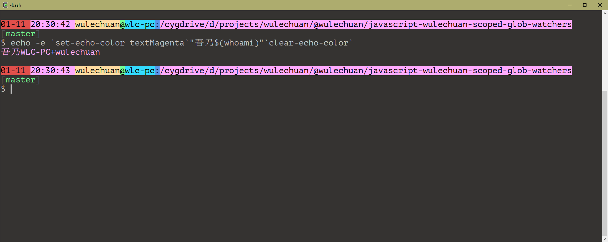
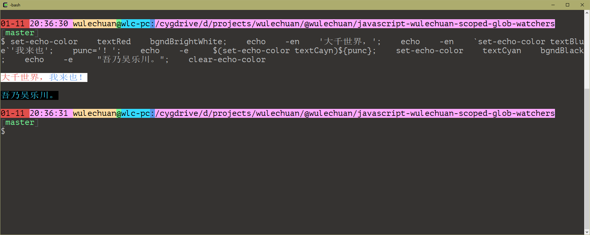
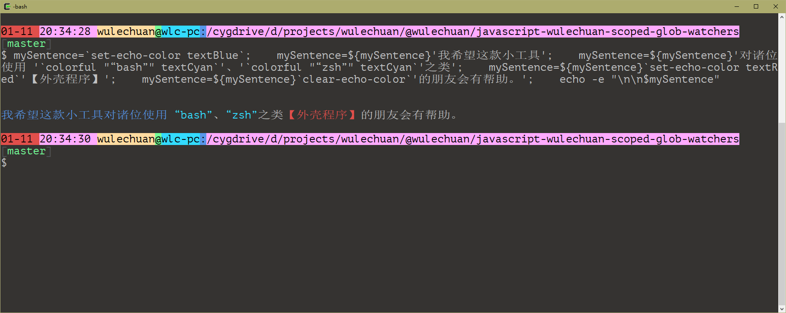

<link rel="stylesheet" href="./docs/styles/markdown-styles-for-vscode-built-in-preview.css">

# Bash 用色工具


## English Version of this ReadMe

It's [here](./docs/ReadMe.en-US.md).


## 简介

在 bash 类环境中对字符串着色易如反掌。

简而言之，该工具为 bash 环境中的字符串着色，并通过内含的 `echo` 语句将着色和的字符串打印输出。

本工具支持所有“古典” ANSI 色彩值。

本工具亦支持【部分】所谓的“_现代_” 色彩名称。


> 本工具支持所有 ANSI
> 色彩，见下文：[本工具所支持的色彩值详表](#本工具所支持的色彩值详表)。


## 使用方法

### 基本用法（调用 `colorful` 函数）


#### 命令行格式
```sh
colorful    [[[[{-n|--}]    <需上色且打印的字符串>]    <颜色名称甲>]    <颜色名称乙>]
```

其中，【颜色名称】对应【ANSI 色彩表】中的 16 种颜色。这些颜色即可用仅于字符的【前景色】，亦可仅用于其【背景色】，还可同时为字符分别配置【前景色】、【背景色】。

第 1 个参数（$1）可取值 `-n` 或 `--`。其中，取 `-n` 代表打印字符串时末尾换行；取 `--` 时代表参数 1 无实际作用。

如果第 1 个参数取值既非 `-n` 也非 `--`，则该参数即为需上色且打印的字符串本身。此种情形下，结尾亦**无**换行符。

总之，如果第 1 个参数不为 `-n`，则打印结果的末尾不会有换行符。除非人为后缀一个 `\n` 符号。


#### 示例

仅对字符串【前景】着色。即仅对文字着色，而不影响文字的衬底颜色。<br/>另，本例中的命令还会在打印“上善若水”之后换行。

```sh
`colorful    -n    "上善若水"    textGreen`
```


仅对字符串【背景】着色。即仅对文字的衬底区域着色，而不影响文字本身的颜色。<br/>另，本例中打印“你好！中华！”后**并不**换行。

```sh
`colorful          "你好！中华！"   bgndRed`
```


同时对字符串的【前景】、【背景】着色。即同时对文字及其衬底着色。<br/>另，本例中打印“我是吴乐川”后**并不**换行。

```sh
`colorful    --    "我是吴乐川"    textBlack    bgndCyan`
```


还可采用所谓“现代”色彩。仅需在色彩名称的中间插入 `Bright` 一词即可。<br/>另，本例中打印“何不令命令行世界同样五彩缤纷？”后**并不**换行。

```sh
`colorful     "何不令命令行世界同样五彩缤纷？"     textBrightBlack     bgndBrightGreen`
```


##### 复杂的例子：构建彩色的【命令提示符】

```sh
function build_rainbow_prompt_in_16_colored_mode {
	PS1=$clearColor'\n'                                                                    # New line


	local dateString=$(date +"%m-%d")
	local clockString=$(date +"%H:%M:%S")
	local userName=`getCurrentUserName`
	local computerName=`hostname`
	local currentFolder='\w' # or we can use `pwd` here


	PS1="$PS1"$(
		colorful "$dateString "      textBlack    bgndRed
		colorful "$clockString "     textBlack    bgndBrightRed
		colorful "$userName"         textBlack    bgndYellow
		colorful '@'                 textBlack    bgndGreen
		colorful '\h'                textBlack    bgndCyan
		colorful ':'                 textBlack    bgndBrightBlue
		colorful "$currentFolder"    textBlack    bgndMagenta
	)

	local gitBranchInfo=`__git_ps1` # 此处须借助一个外来工具。见 https://github.com/git/git/blob/master/contrib/completion/git-prompt.sh
	if [ ! -z "$gitBranchInfo" ]; then
		PS1="$PS1\n"$(
			colorful '['                 textBrightBlack
			colorful "$gitBranchInfo"    textGreen
			colorful ']'                 textBrightBlack
		)
	fi

	PS1="$PS1\n\$ "
}

export PROMPT_COMMAND='build_rainbow_prompt_in_16_colored_mode';
```
> 注意，获取上图中的 git 分支信息，须借助一个外来工具。见：
> https://github.com/git/git/blob/master/contrib/completion/git-prompt.sh


上例中定义的彩色【命令提示符】的最终效果如下图：


### 借助 `set-echo-color` 和 `clear-echo-color` 【函数对】的用法

前述诸例均以【`colorful` 函数调用】之法运用本工具，即调用 `colorful`
这一函数直接输出彩色字符串。然而，我们偶尔会遭遇此法不通之情形。

此时须改用他法。具体而言，即采用 `set-echo-color` 和 `clear-echo-color` 这【一对】函数配合，以达到目的。大致步骤如下：

1.  首先，调用 `set-echo-color`
    配好色彩环境。自此，所有字符串均会采用这种色彩环境中的颜色。

2.  而后，照常自由使用字符串。

3.  当不再需要继续使用上述色彩环境时，调用 `clear-echo-color`
    来清除色彩环境配置，令此后的字符串均采用 Bash 类环境的默认色彩配置。

> `set-echo-color` 和 `clear-echo-color` 二者均可在 `echo`
> 语句中嵌套，亦可用于字符串拼接语句之中。

> 另，Bash 环境的语法规定，在字符串语境中调用函数，须采用【重音符】`` ` ``
> 将该【函数调用】包括起来。


#### 命令行格式
```sh
set-echo-color    [[<colorName1>]    <colorName2>]
```

```sh
clear-echo-color
```


#### 示例

##### 例 1

在单一语句中的运用。

```sh
echo -e `set-echo-color textMagenta`"吾乃$(whoami)"`clear-echo-color`
```

运行结果：




##### 例 2

亦可多次调用 `set-echo-color`。

```sh
set-echo-color    textRed    bgndBrightWhite

echo    -en    '大千世界，'
echo    -en    `set-echo-color textBlue`'我来也'

punc='！'
echo    -e     $(set-echo-color textCayn)${punc}

set-echo-color    textCyan    bgndBlack
echo    -e     "吾乃吴乐川。"

clear-echo-color
```

运行结果：




##### 例 3

在字符串拼接语境中的运用。

```sh
mySentence=`set-echo-color textBlue`
mySentence=${mySentence}'我希望这款小工具'
mySentence=${mySentence}'对诸位使用 '`colorful "“bash”" textCyan`'、'`colorful "“zsh”" textCyan`'之类'
mySentence=${mySentence}`set-echo-color textRed`'【外壳程序】'
mySentence=${mySentence}`clear-echo-color`'的朋友会有帮助。'

echo -e "\n\n$mySentence"
```

> 注意到，上例中故意混合运用了 【`colorful`
> 函数】和【`set-echo-color`、`clear-echo-color` 函数对】。

运行结果：




## 本工具所支持的色彩值详表

> 另，完整的 ANSI 色彩表参加：<https://en.wikipedia.org/wiki/ANSI_escape_code>.

### 所谓“古典”的【前景】色

| Color Name  | ANSI Value |
| ----------- | ---------- |
| textBlack   | 30         |
| textRed     | 31         |
| textGreen   | 32         |
| textYellow  | 33         |
| textBlue    | 34         |
| textMagenta | 35         |
| textCyan    | 36         |
| textWhite   | 37         |


### 所谓“古典”的【背景】色

| Color Name  | ANSI Value |
| ----------- | ---------- |
| bgndBlack   | 40         |
| bgndRed     | 41         |
| bgndGreen   | 42         |
| bgndYellow  | 43         |
| bgndBlue    | 44         |
| bgndMagenta | 45         |
| bgndCyan    | 46         |
| bgndWhite   | 47         |


### 所谓“现代”的【前景】色
> 微软公司的 VS Code 中的【终端】环境对所谓“现代”色表支持得不好。

| Color Name        | ANSI Value |
| ----------------- | ---------- |
| textBrightBlack   | 90         |
| textBrightRed     | 91         |
| textBrightGreen   | 92         |
| textBrightYellow  | 99         |
| textBrightBlue    | 94         |
| textBrightMagenta | 95         |
| textBrightCyan    | 96         |
| textBrightWhite   | 97         |


### 所谓“现代”的【背景】色
> 微软公司的 VS Code 中的【终端】环境对所谓“现代”色表支持得不好。

| Color Name        | ANSI Value |
| ----------------- | ---------- |
| bgndBrightBlack   | 100        |
| bgndBrightRed     | 101        |
| bgndBrightGreen   | 102        |
| bgndBrightYellow  | 103        |
| bgndBrightBlue    | 104        |
| bgndBrightMagenta | 105        |
| bgndBrightCyan    | 106        |
| bgndBrightWhite   | 107        |


## 许可证

| 类目       | 内容                                            |
| ---------- | ----------------------------------------------- |
| 作者       | [wulechuan@live.com](mailto:wulechuan@live.com) |
| 许可证类型 | [WTFPL](http://www.wtfpl.net)                   |