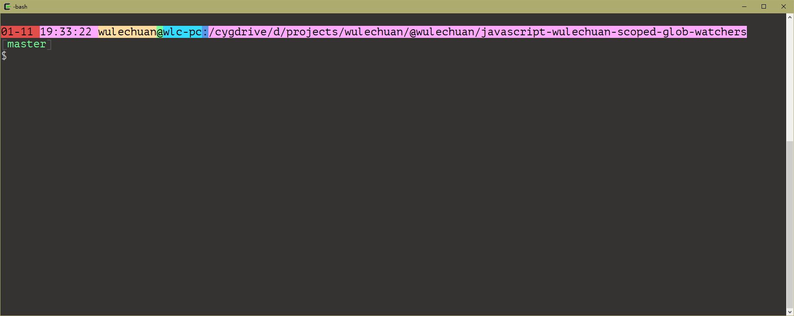

<link rel="stylesheet" href="./docs/styles/markdown-styles-for-vscode-built-in-preview.css">

# Bash Coloring Tool


## 简体中文指南（Chinese Simplified Version of ReadMe）

中文版《使用指南》[在此](./ReadMe.zh-CN.md)。


## Introduction

Using colors in bash strings is now made easier.

This little tool supports classical ANSI colors.
And you can use them either in foreground (text colors) or background, or both.

It supports so-called _modern_ colors as well.
> For a complete list of supported color names,
> see below [Supported Color Names](#SupportedColorNames).


## Usage

### Basic (invoking the `colorful` function)

#### CLI Format
```sh
colorful    [[[[{-n|--}]    <raw string>]    <colorName1>]    <colorName2>]
```

Note that the first argument($1) can be either `-n` or `--`,
where `-n` means "append a line break at end",
and `--` is simple a placeholder that means nothing.

If the first argument is neither `-n` nor `--`,
then it's treated as the raw string to colorize and print.
In this situation, no line break will be added at end.


#### Examples

##### Basic Examples

Shade only the foreground color, and append a line break at end:

```sh
colorful    -n    "Hello world"      textGreen
```


Shade only the background color:

```sh
colorful          "Hello China"      bgndRed
```


Shade both foreground and background colors:
```sh
colorful    --    "I'm wulechuan"    textBlack    bgndCyan
```


Using so-called _modern_ colors.
Simply insert the keyword `Bright` before color names will do.

```sh
colorful    "Let's try some more colors"    textBrightBlack    bgndBrightGreen
```


##### Complex Example: to build a colorful prompt string

```sh
function build_rainbow_prompt_in_16_colored_mode {
	PS1=$clearColor'\n'                                                                    # New line


	local dateString=$(date +"%m-%d")
	local clockString=$(date +"%H:%M:%S")
	local userName=`getCurrentUserName`
	local computerName=`hostname`
	local currentFolder='\w' # or you can use `pwd` here


	PS1="$PS1"$(
		colorful "$dateString "      textBlack    bgndRed
		colorful "$clockString "     textBlack    bgndBrightRed
		colorful "$userName"         textBlack    bgndYellow
		colorful '@'                 textBlack    bgndGreen
		colorful '\h'                textBlack    bgndCyan
		colorful ':'                 textBlack    bgndBrightBlue
		colorful "$currentFolder"    textBlack    bgndMagenta
	)

	local gitBranchInfo=`__git_ps1` # this is an third party function. see https://github.com/git/git/blob/master/contrib/completion/git-prompt.sh
	if [ ! -z "$gitBranchInfo" ]; then
		PS1="$PS1\n"$(
			colorful '['                 textBrightBlack
			colorful "$gitBranchInfo"    textGreen
			colorful ']'                 textBrightBlack
		)
	fi

	PS1="$PS1\n\$ "
}

export PROMPT_COMMAND='build_rainbow_prompt_in_16_colored_mode';
```

> Note that to get the git branch infomation, a third party tool is require.
> The said tool is provided here:
> https://github.com/git/git/blob/master/contrib/completion/git-prompt.sh

Here is the snapshot of the colorful prompt string defined in the example above:



### Utilizing `set-echo-color` and `clear-echo-color` as a pair.

In case a direct function call doesn't work, 
you can utilize two functions as a pair to achieve the same object,
the `set-echo-color`, and the `clear-echo-color`.

1. You first use `set-echo-color` to start shading.

2. Then, you can work with your strings, like do some `echo`s
   or concatenate some strings into a variable.

3. When you are done, you use `clear-echo-color` to clean colors.

#### CLI Format
```sh
set-echo-color    [[<colorName1>]    <colorName2>]
```

```sh
clear-echo-color
```


#### Examples

##### Example 1

A very simple example.

```sh
set-echo-color    textMagenta
echo    -e    "I'm $(whoami)"
clear-echo-color
```

Result:


##### Example 2

You can use it before or inside multiple `echo` commands:

```sh
set-echo-color    textRed    bgndBrightWhite

echo    -en    'Hello'
echo    -en    `set-echo-color textBlue`' world'

punc='!'
echo    -e     $(set-echo-color textCayn)${punc}

set-echo-color    textCyan    bgndBlack
echo    -e     "I'm wulechuan."

clear-echo-color
```

Result:


##### Example 3

You can also invoke `set-echo-color` and `clear-echo-color` during string concatenations,
like this:

```sh
mySentence=`set-echo-color textBlue`
mySentence=${mySentence}'I hope this tool can help everyone'
mySentence=${mySentence}' who works with '`colorful bash textCyan`'/'`colorful zsh textCyan`', etc.'
mySentence=${mySentence}`clear-echo-color`

echo -e "\n\n$mySentence"
```

> Notice the mixed ways of using this tool shown in the example above.
> Both the `colorful` function and the `set-echo-color`/`clear-echo-color` pair are used.
Result:


## Supported Color Names

> For ANSI color full table, see: <https://en.wikipedia.org/wiki/ANSI_escape_code>.

### Classical Foreground Colors

| Color Name  | ANSI Value |
| ----------- | ---------- |
| textBlack   | 30         |
| textRed     | 31         |
| textGreen   | 32         |
| textYellow  | 33         |
| textBlue    | 34         |
| textMagenta | 35         |
| textCyan    | 36         |
| textWhite   | 37         |


### Classical Background Colors

| Color Name  | ANSI Value |
| ----------- | ---------- |
| bgndBlack   | 40         |
| bgndRed     | 41         |
| bgndGreen   | 42         |
| bgndYellow  | 43         |
| bgndBlue    | 44         |
| bgndMagenta | 45         |
| bgndCyan    | 46         |
| bgndWhite   | 47         |


### Morden Foreground Colors
> modern colors are **not** supported by Microsoft VSCode terminal.

| Color Name        | ANSI Value |
| ----------------- | ---------- |
| textBrightBlack   | 90         |
| textBrightRed     | 91         |
| textBrightGreen   | 92         |
| textBrightYellow  | 99         |
| textBrightBlue    | 94         |
| textBrightMagenta | 95         |
| textBrightCyan    | 96         |
| textBrightWhite   | 97         |


### Morden Background Colors
> modern colors are **not** supported by Microsoft VSCode terminal.

| Color Name        | ANSI Value |
| ----------------- | ---------- |
| bgndBrightBlack   | 100        |
| bgndBrightRed     | 101        |
| bgndBrightGreen   | 102        |
| bgndBrightYellow  | 103        |
| bgndBrightBlue    | 104        |
| bgndBrightMagenta | 105        |
| bgndBrightCyan    | 106        |
| bgndBrightWhite   | 107        |


## License

| Item         | Content                                         |
| ------------ | ----------------------------------------------- |
| Author       | [wulechuan@live.com](mailto:wulechuan@live.com) |
| License Type | [WTFPL](http://www.wtfpl.net)                   |