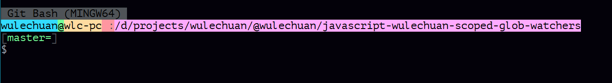

<link rel="stylesheet" href="./docs/styles/markdown-styles-for-vscode-built-in-preview.css">

# 简介

在 `bash` 类环境中对字符串着色易如反掌。

作者：[wulechuan@live.com](mailto:wulechuan@live.com)


# 使用方法

## 示例

### 基本用法

本工具支持所有“古典” ANSI 色彩值。

这些【ANSI 色彩】既可单独用于 Bash 类环境中，各色字符串的【前景色】，亦可单独用于其【背景色】，还可同时配置这些字符串的【前景色】、【背景色】。

> 本工具支持所有 ANSI
> 色彩，见下文：[本工具所支持的色彩值详表](#本工具所支持的色彩值详表)。

-   仅对字符串【前景】着色。即仅对文字着色，而不影响文字的衬底颜色：

    ```sh
    `colorful "上善若水" textGreen`
    ```

-   仅对字符串【背景】着色。即仅对文字的衬底区域着色，而不影响文字本身的颜色：

    ```sh
    `colorful "你好！中华！" bgndRed`
    ```

-   同时对字符串的【前景】、【背景】着色。即同时对文字及其衬底着色：

    ```sh
    `colorful "我是吴乐川" textBlack bgndCyan`
    ```

本工具亦支持【部分】所谓的“现代” 色彩名称。

仅需在色彩名称的中间插入 `Bright` 一词即可。见下例：

```sh
`colorful "何不令命令行世界同样五彩缤纷？" textBrightBlack bgndBrightGreen`
```
再看一个复杂点儿的例子。下例展示了利用本工具方便的自定义【命令提示符】的做法：

```sh
GIT_PS1_SHOWDIRTYSTATE=true
GIT_PS1_SHOWUNTRACKEDFILES=true
GIT_PS1_SHOWUPSTREAM="auto"
GIT_PS1_HIDE_IF_PWD_IGNORED=true

function _customize_prompt_with_git_branch_info_ {
	local osType=''

	if [ -r 'etc/issue' ]; then
		osType=`cat /etc/issue`
		osType=${osType/Kernel*/}
		osType=`colorful " $osType" textBlack bgndBrightBlack`'\n'
	fi

	PS1=`clear-color`
	PS1=$PS1$osType'\n'

	PS1=$PS1`colorful "\u" textBlack       bgndCyan`      # user
	PS1=$PS1`colorful "@"  textBlack       bgndGreen`     # @
	PS1=$PS1`colorful "\h" textBlack       bgndYellow`    # host
	PS1=$PS1`colorful " :" textBrightBlack bgndBrightRed` # :
	PS1=$PS1`colorful "\w" textBlack       bgndMagenta`   # current working directory

	PS1=$PS1'`__git_ps1_or_empty_string`'

	PS1=$PS1'\n'
	PS1=$PS1'$ '                                          # last prompt sign: $<space>
}

function __git_ps1_or_empty_string () {
	local gitBranchInfo=

	if test -z "$WINELOADERNOEXEC"
	then
		GIT_EXEC_PATH="$(git --exec-path 2>/dev/null)"
		COMPLETION_PATH="${GIT_EXEC_PATH%/libexec/git-core}"
		COMPLETION_PATH="${COMPLETION_PATH%/lib/git-core}"
		COMPLETION_PATH="$COMPLETION_PATH/share/git/completion"
		if test -f "$COMPLETION_PATH/git-prompt.sh"
		then
			. "$COMPLETION_PATH/git-completion.bash"
			. "$COMPLETION_PATH/git-prompt.sh"
			gitBranchInfo=`__git_ps1 "%s"`     # bash function
		fi
	else
		gitBranchInfo="$(__git_ps1 '%s')"
	fi

	if [ -z "$gitBranchInfo" ]; then
		echo -n ''
		return
	fi

	echo
	echo `colorful '[' textBrightBlack``colorful $gitBranchInfo textGreen``colorful ']' textBrightBlack`
}
```

上例的最终效果如下图：




### 万一【本工具作为函数直接调用】的方法失效怎么办？

前述诸例均以【函数调用】之法运用本工具，即调用名为 `colorful`
这一函数。不幸的是，我们偶尔会遭遇此法不通之情形。

此时须改用他法。具体而言，即采用 `set-color` 和 `clear-color` 这【一对】函数配合，以达到目的。大致步骤如下：

1.  首先，调用 `set-color`
    配好色彩环境。自此，所有字符串均会采用这种色彩环境中的颜色。

2.  而后，照常自由使用字符串。

3.  当不再需要继续使用上述色彩环境时，调用 `clear-color`
    来清除色彩环境配置，令此后的字符串均采用 Bash 类环境的默认色彩配置。

> `set-color` 和 `clear-color` 二者均可在 `echo`
> 语句中嵌套，亦可用于字符串拼接语句之中。

> 另，Bash 环境的语法规定，在字符串语境中调用函数，须采用【重音符】`` ` ``
> 将该【函数调用】包括起来。

例1，单一语句中的运用：

```sh
echo -e `set-color textMagenta`"I'm $(whoami)"`clear-color`
```
例2，多次调用 `set-color`：

```sh
punc='!'
echo -e `set-color textRed bgndBrightWhite`
echo -en 'Hello'
echo -en `set-color textBlue`' world'
echo -en `set-color textCayn`$punc
echo `clear-color`
```

例3，字符串拼接语境中的运用：

```sh
mySentence=`set-color textBlue`
mySentence=$mySentence'I hope this tool can help everyone'
mySentence=$mySentence' who works with '`colorful bash textCyan`'/'`colorful zsh textCyan`', etc.'
mySentence=$mySentence`clear-color`

echo -e $mySentence
```

> 注意到，上例中故意混合运用了 【`colorful`
> 函数】和【`set-color`、`clear-color` 双函数组】。


# 本工具所支持的色彩值详表

> 另，完整的 ANSI 色彩表参加：<https://en.wikipedia.org/wiki/ANSI_escape_code>.

## 所谓“古典”的【前景】色

| Color Name  | ANSI Value |
| ----------- | ---------- |
| textBlack   | 30         |
| textRed     | 31         |
| textGreen   | 32         |
| textYellow  | 33         |
| textBlue    | 34         |
| textMagenta | 35         |
| textCyan    | 36         |
| textWhite   | 37         |


## 所谓“古典”的【背景】色

| Color Name  | ANSI Value |
| ----------- | ---------- |
| bgndBlack   | 40         |
| bgndRed     | 41         |
| bgndGreen   | 42         |
| bgndYellow  | 43         |
| bgndBlue    | 44         |
| bgndMagenta | 45         |
| bgndCyan    | 46         |
| bgndWhite   | 47         |


## 所谓“现代”的【前景】色

| Color Name        | ANSI Value |
| ----------------- | ---------- |
| textBrightBlack   | 90         |
| textBrightRed     | 91         |
| textBrightGreen   | 92         |
| textBrightYellow  | 99         |
| textBrightBlue    | 94         |
| textBrightMagenta | 95         |
| textBrightCyan    | 96         |
| textBrightWhite   | 97         |


## 所谓“现代”的【背景】色

| Color Name        | ANSI Value |
| ----------------- | ---------- |
| bgndBrightBlack   | 100        |
| bgndBrightRed     | 101        |
| bgndBrightGreen   | 102        |
| bgndBrightYellow  | 103        |
| bgndBrightBlue    | 104        |
| bgndBrightMagenta | 105        |
| bgndBrightCyan    | 106        |
| bgndBrightWhite   | 107        |


# License

| Key    | Value                         |
| ------ | ----------------------------- |
| Author | wulechuan@live.com            |
| Type   | [WTFPL](http://www.wtfpl.net) |